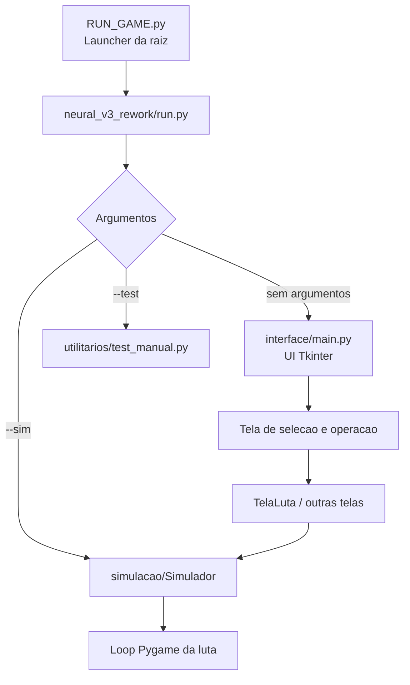
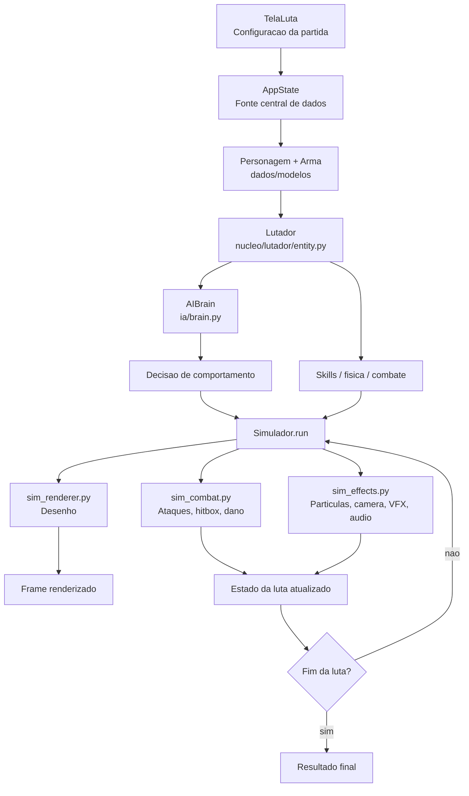
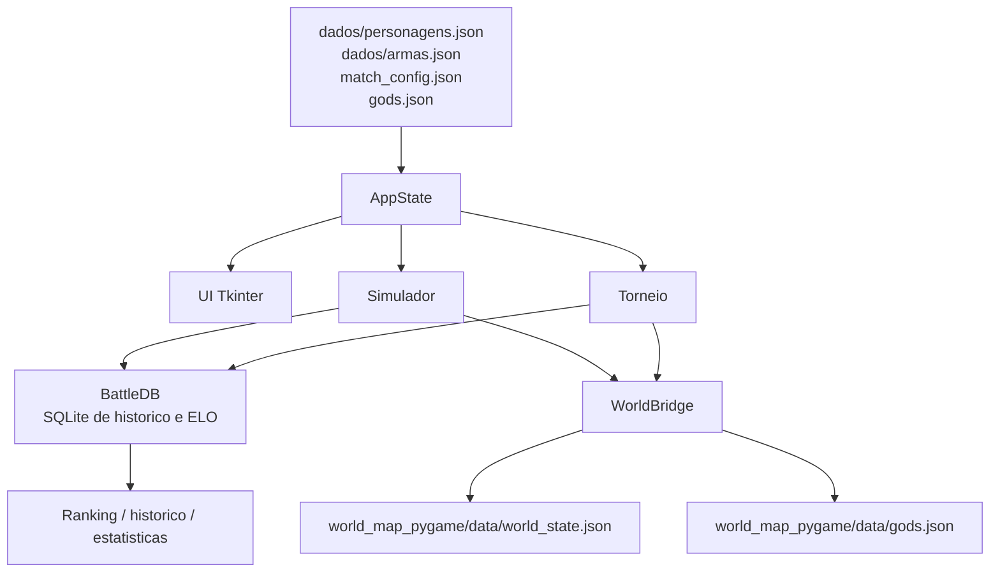
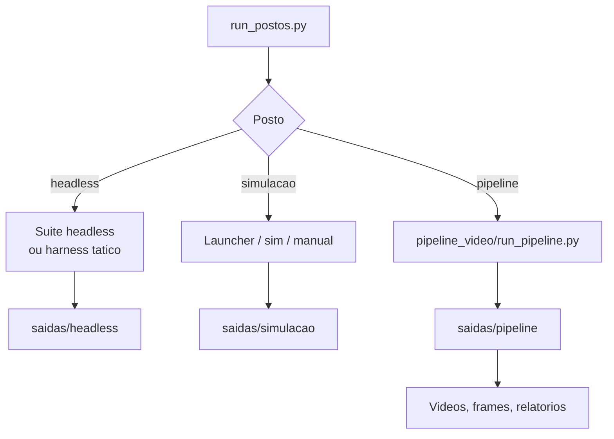

# Fluxograma do Projeto Neural

Este documento resume como o projeto `neural/` funciona hoje no workspace atual. A pasta raiz atua como um hub com dois aplicativos:

- `neural_v3_rework/`: simulador principal de combate 2D
- `world_map_pygame/`: mapa-mundi separado, integrado aos resultados das lutas

O fluxo principal passa por launcher, interface, estado central, simulacao, IA, persistencia e, opcionalmente, sincronizacao com o world map.

## 1. Entrada Ate a Execucao

O caminho padrao comeca no launcher da raiz e encaminha a execucao para o projeto principal. A partir dali, o sistema pode abrir a UI Tkinter, rodar simulacao direta ou modo de teste manual.

## 2. Runtime da Luta

Quando a luta e iniciada, a interface consulta o estado central, monta os combatentes e entrega tudo para o simulador. O loop principal atualiza IA, fisica, combate, efeitos e renderizacao a cada frame ate o resultado final.

## 3. Dados e Persistencia

O projeto usa JSON como base de configuracao e cadastro, com `AppState` como ponto central de leitura e escrita. Resultados de lutas e estatisticas podem seguir para SQLite, e o vencedor tambem pode propagar efeitos para o `world_map_pygame`.

## 4. Modos Operacionais

O arquivo `run_postos.py` funciona como orquestrador de operacao. Ele separa execucoes de simulacao, headless e pipeline de video, padronizando logs e saidas em `saidas/`.

## Como Ler a Arquitetura

- `interface`: telas Tkinter para operar o sistema, selecionar personagens, iniciar lutas e consultar visoes auxiliares.
- `simulacao`: loop Pygame da luta, dividido em renderer, combate e efeitos.
- `nucleo`: entidades, hitbox, arena, fisica, combate e catalogo de skills.
- `ia`: cerebro dos bots, com modulos de percepcao, combate, evasao, spatial awareness e coreografia.
- `modelos`: definicao de `Personagem`, `Arma` e constantes de classes e tipos.
- `dados`: JSONs de entrada, `AppState`, banco SQLite e ponte com o world map.
- `efeitos`: camera, particulas, audio e VFX usados durante a luta.
- `torneio`: bracket, progresso e execucao automatizada de confrontos.
- `pipeline_video`: geracao e exportacao de videos a partir das lutas.
- `world_map_pygame`: subsistema externo integrado via `WorldBridge`, consumindo resultados para atualizar territorio e estado global.

## Resumo Mental do Sistema

Pense no projeto em tres camadas:

1. Operacao: launchers, UI e postos de execucao.
2. Runtime: `AppState` entrega dados, a simulacao cria `Lutador`, a IA decide e o loop Pygame resolve a luta.
3. Persistencia e integracao: resultados vao para SQLite e podem refletir no `world_map_pygame`.
